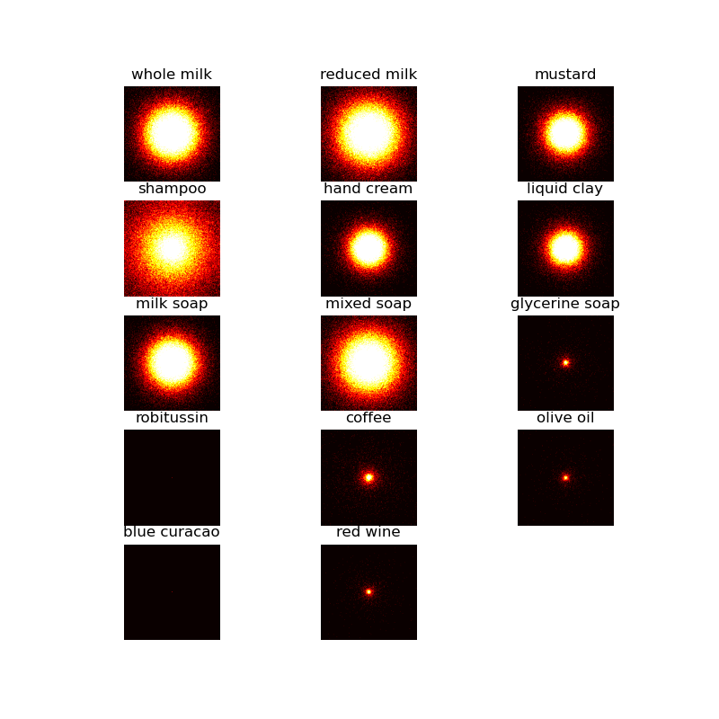
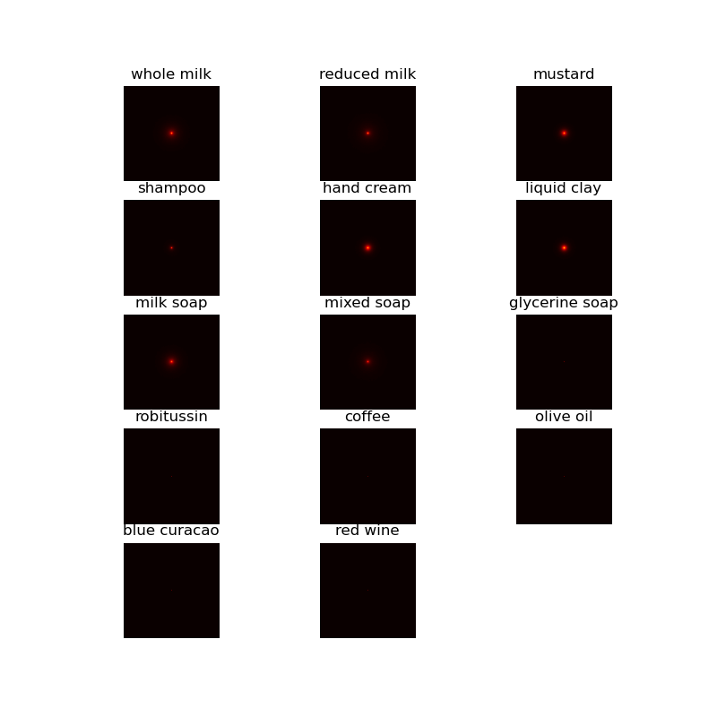

# Machine Learning of the Phase Function

Summer-intern project supervised by Prof. [Ge Wang](https://biotech.rpi.edu/centers/bic/people/faculty/ge-wang), Rensselaer Polytechnic Institute (RPI).

Started from May, 2021.

## Objective

Building a phase function model for light propagation in medium using machine learning methods. 

Prof. Ge Wang: *We can “invert” M-C simulation (which can be CW, frequency-modulated, or time-resolved) to fit the underlying phase function for a homogeneous slab tissue: 1) simulate with HG phase functions with various parameters, and then learn from data so that we have a HG phase function equivalent network model, and 2) in MOSE we perturb the HG phase function and produce simulated data again, and then the network model can fit into the perturbed phase function.*  

## Background

### Henyey and Greenstein (H-G) phase function 

Reference of H-G function: [HG_Note](https://www.astro.umd.edu/~jph/HG_note.pdf)

Steven Jacques, Scott Prahl, [Introduction to Biomedical Optics](https://omlc.org/classroom/ece532/), Course of Oregon Graduate Institute

### Molecular Optical Simulation Environment (MOSE)

[MOSE](http://www.radiomics.net.cn/platform/docs/4) is a software platform for the simulation of light propagation in turbid media. The development of MOSE was initiated by Prof. Ge Wang and his collaborators. In this project, I use a modified command line version of MOSE provided by Dr. Shenghan Ren, the former team leader of MOSE. 

References:

1. Shenghan Ren, Xueli Chen, Hailong Wang, Xiaochao Qu, Ge Wang, Jimin Liang, and Jie Tian, [Molecular Optical Simulation Environment (MOSE): A Platform for the Simulation of Light Propagation in Turbid Media](https://journals.plos.org/plosone/article?id=10.1371/journal.pone.0061304), Plos One, 8(4):e61304, 2013.
2. Shenghan Ren, A Study on Efficient Method for Optical Tomography, Ph.D thesis, Xidian University, 2016. (In Chinese)

## Methods

### Development Environment 
    - Windows 10
    - Cuda 10.2
    - Matlab 2020b
    - Anaconda3 2021.05
    - Python 3.8
    - Pytorch 1.8.1

### Data Generation

The command line MOSE program is located in /MOSE along with the dependency runtime libraries. The phantom and simulation parameters are listed in the "mse" config file. Some parameters, such as the absorption coefficient $\mu_a$, scattering coefficient $\mu_s$, anisotropy factor $g$ of H-G function, and refractive index $n$, can be overridden by command line parameters. As a first attempt, the continuous wave mode of MOSE is used in the following experiments.

    moseVCTest.exe configFileName outputDataFileName mu_a mu_s g n

First, simulated top-view observations of a homogeneous slab are generated using the MATLAB program [Step1_GenerateRawData_CW_v3.m](Step1_GenerateRawData_CW_v3.m), which calls the MOSE program to simulate the propagation of light through the slab. The optical parameters of the slab are selected in the typical ranges. 

- absorption coefficient: $\mu_a = [0.001, 0.05, 0.1, 0.5, 1, 2, 5, 10]$ $mm^{-1}$
- scattering coefficient: $\mu_s = [0.01, 0.05, 0.1, 0.5, 1, 5, 10, 50, 100]$ $mm^{-1}$
- anistropic scattering coefficient: $g = [-1:0.1:1]$
- refraction index: $n = 1.3$

For each combination of optical parameters ($\mu_a$, $\mu_s$ and $g$), 80 observations were generated as training data for the neural network and 20 as testing data. Since MOSE saves all side-view observations of the slab, another MATLAB program ([Step2_ChangeRawData2Mat_CW.m](Step2_ChangeRawData2Mat_CW.m)) is written to extract only the top-view image. The images are saved in mat format to maintain the data accuracy. 

For some combination of optical parameters, very few photons reach the top-view. In the following experiments, images with less than 1% of the total number of pixels having pixel values greater than 0 are excluded because they would hinder the training of the neural network.

Some images randomly selected from the training set are shown in the following figures. 

### Regression Anisotropy Factor using Neural Network

