# Estimation of Phase Function based on Machine Learning

Summer intern project supervised by Prof. [Ge Wang](https://biotech.rpi.edu/centers/bic/people/faculty/ge-wang), Rensselaer Polytechnic Institute (RPI).

Started from May, 2021.

This repo hosts my code for the summer intern project aimed at estimating the phase function of light propagation in a medium directly from the transmittance images. The feasibility of data-driven deep learning approach is explored. I started coding in MATLAB to generate the simulation data and a first model, and then moved to Python and Pytroch. All versions of the code, whether perfect or not, are saved here to record my learning trajectory. I will clean up the code and put them into a new repo when the final report is done.
 

**Note**: Install _MathJax Plugin for Github_ from Chrome Store to show the mathematical equations correctly.

## Objective

Building a phase function model for light propagation in medium using data-driven machine learning methods. 

Prof. Ge Wang: *We can “invert” M-C simulation (which can be CW, frequency-modulated, or time-resolved) to fit the underlying phase function for a homogeneous slab tissue: 1) simulate with HG phase functions with various parameters, and then learn from data so that we have a HG phase function equivalent network model, and 2) in MOSE we perturb the HG phase function and produce simulated data again, and then the network model can fit into the perturbed phase function.*  

## Background

### Henyey and Greenstein (H-G) phase function 

Reference of H-G function: [HG_Note](https://www.astro.umd.edu/~jph/HG_note.pdf)

Steven Jacques, Scott Prahl, [Introduction to Biomedical Optics](https://omlc.org/classroom/ece532/), Course of Oregon Graduate Institute

### Molecular Optical Simulation Environment (MOSE)

[MOSE](http://www.radiomics.net.cn/platform/docs/4) is a software platform for the simulation of light propagation in turbid media. The development of MOSE was initiated by Prof. Ge Wang and his collaborators. In this project, I use a modified command line version of MOSE provided by Dr. Shenghan Ren, the former team leader of MOSE. 

References:

1. Shenghan Ren, Xueli Chen, Hailong Wang, Xiaochao Qu, Ge Wang, Jimin Liang, and Jie Tian, [Molecular Optical Simulation Environment (MOSE): A Platform for the Simulation of Light Propagation in Turbid Media](https://journals.plos.org/plosone/article?id=10.1371/journal.pone.0061304), Plos One, 8(4):e61304, 2013.
2. Shenghan Ren, A Study on Efficient Method for Optical Tomography, Ph.D thesis, Xidian University, 2016. (In Chinese)

## Methods

### Development Environment 
    - Windows 10
    - Cuda 10.2
    - Matlab 2020b
    - Anaconda3 2021.05
    - Python 3.8
    - Pytorch 1.8.1

### Step 1: Data Generation

A single layer homogenous tissue phantom is adopted to conduct the study. The diagram of the phantom is shown in Fig. 1. The size of the phantom is $10 mm \times 10 mm \times 2 mm$ $(x, y, z)$. 

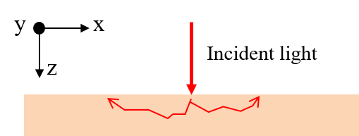

Fig. 1. Diagram of the phantom

The command line MOSE program is located in /MOSE along with the dependency runtime libraries. The phantom and simulation parameters are listed in the "mse" config file. Some parameters, such as the absorption coefficient $\mu_a$, scattering coefficient $\mu_s$, anisotropy factor $g$ of H-G function, and refractive index $n$, can be overridden by command line parameters. As a first attempt, the continuous wave mode of MOSE is used in the following experiments.

    moseVCTest.exe configFileName outputDataFileName mu_a mu_s g n

First, simulated top-view observations of a homogeneous slab are generated using the MATLAB program [Step1_GenerateRawData_CW_v3.m](Step1_GenerateRawData_CW_v3.m), which calls the MOSE program to simulate the propagation of light through the slab. The optical parameters of the slab are selected in the typical ranges. 

- absorption coefficient: $\mu_a = [0.001, 0.05, 0.1, 0.5, 1, 2, 5, 10]$ $mm^{-1}$
- scattering coefficient: $\mu_s = [0.01, 0.05, 0.1, 0.5, 1, 5, 10, 50, 100]$ $mm^{-1}$
- anistropic scattering coefficient: $g = [-1:0.1:1]$
- refraction index: $n = 1.3$

For each combination of optical parameters ($\mu_a$, $\mu_s$ and $g$), 80 observations were generated as training data for the neural network and 20 as testing data. For each MOSE run, one million photons are simulated. The spatial resolution of the phantom is set to $0.02 mm \times 0.02 mm \times 0.1 mm$ $(x,y,z)$, resulting the image size of $500 \times 500$ for the top-view and bottom-view transmittance images. 

### Step 2: Data Format Conversion

Since MOSE saves all side-view observations of the slab, another MATLAB program ([Step2_ChangeRawData2Mat_CW_v3.m](Step2_ChangeRawData2Mat_CW_v3.m)) is written to extract only the top-view image. The images are saved in mat format to maintain the data accuracy. 

[comment]: <> (For some combination of optical parameters, very few photons reach the top-view. In the following experiments, images with less than 1% of the total number of pixels having pixel values greater than 0 are excluded because they would hinder the training of the neural network.)

Some images randomly selected from the training set are shown in Fig. 2. 

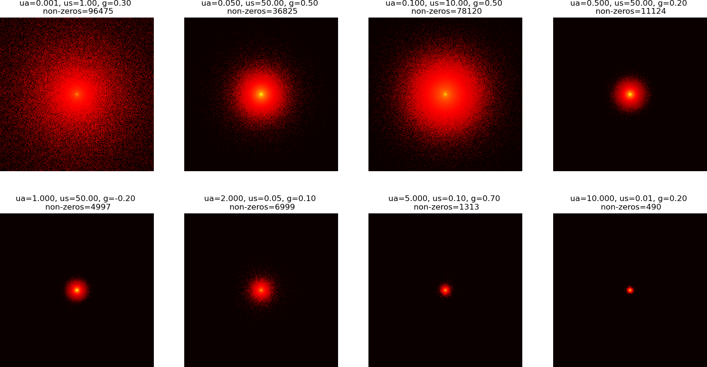

Fig. 2. Example of simulated images

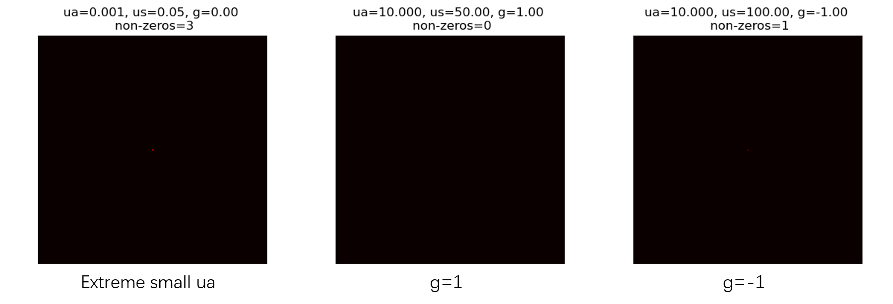

Fig. 3. Example of extreme images

Some extreme parameter values, such extreme small ua, g=1 and g=-1, produce images with very few non-zero pixels (Fig. 3). These images do provide information about the material properties, but they do not provide enough information for CNN to learn.  These images are excluded from the dataset.

### Step 3: Estimation of Optical Parameters (Model-1)

As my first try, a convolutional neural network (CNN) is designed to regress the optical parameters $u_a$, $u_s$, and $g$. The diagram of the network is shown in Fig. 4, which consists of 6 convolution layers and one fully connected (FC) layer. Each convolution layer is composed by stacking a $3\times 3$ convolution, a batch normalization layer, and a ReLU layer. The output of the last convolutional layer is flattened to a vector, which is used as the input of the FC layer. The output layer of FC adopts the sigmoid activation function. Therefore the ground truth values of $u_a, u_s$ and $g$ are normalized to [0.01, 1] when the network is trained. The lower limit of 0.01 is chosen to facilitate the calculation of the relative error (RE). 

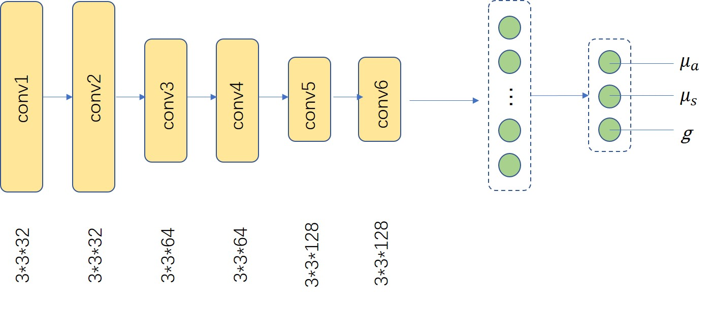

Fig. 4. Diagram of Model-1, a neural network for optical parameter regression

#### Implement Details: [Step3_Regression_Parameters_v2.py](Step3_Regression_Parameters_v2.py)

    GPU: Titan Xp
    Loss function: MSE
    Optimizer: Adam
    Initial learning rate: 5e-4, decreased by a factor of 0.1 every 10 epochs
    Weight decay: 5e-3
    Batch size: 60
    Training epochs: 20

The images are normalized based on the mean and standard deviation of images in the training dataset before feeding into the neural network. The mean and standard deviation of the training dataset are calculated by [Step3_CalcMeanSTD.py](Step3_CalcMeanSTD.py). 

#### Results of Model-1:

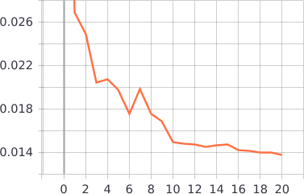

Fig. 5. Chart of train loss

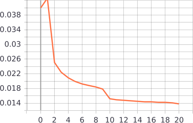

Fig. 6. Chart of validation loss

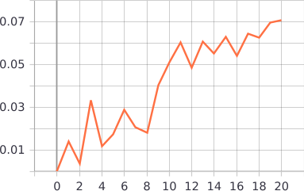

Fig. 7. Rate of samples with relative error less than 10%

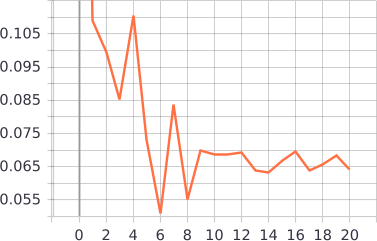

Fig. 8. Rate of samples with relative error greater than 50%

The results demonstrate that, first of all, the training procedure converges (Fig. 5, Fig. 6), and the network learns to predict the optical parameters. The prediction accuracy improves as the learning process proceeds, as shown by the increasing rate of small relative error samples (Fig. 7) and decreasing rate of large relative error samples (Fig. 8).  

### Step 4: Estimation the Phase Function together with the optical parameters (Model-2)

Since the objective of this study is to estimate the phase function directly from the observations, Model-1 is modified to estimate the phase function together with $u_a$ and $u_s$. The diagram of the model (Model-2) is shown in Fig. 9. The Gaussian Mixture Model (GMM) is used to fit the phase function. The FC layer estimates the parameters of the Gaussian kernels including the weight $w_i$, the mean $m_i$, and the standard deviation $\sigma_i$, $i=1,\dots,N$, where $N$ is the number of Gaussian kernels, which is set to 10 in the following experiments. Therefore the outputs of the FC layer consists of $N\times 3$ neurons for Gaussian kernel estimation and 2 neurons for $u_a$ and $u_s$ estimation. 

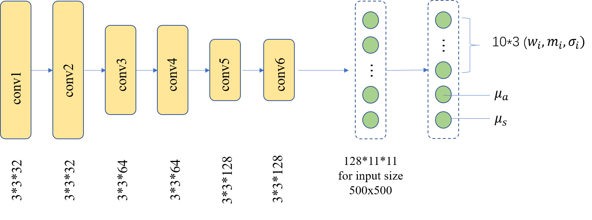

Fig. 9. Diagram of Model-2, estimating the phase function and optical parameters simultaneously

#### Loss Function

The loss function of Model-2 is defined as $loss = loss_{phase} + loss_{uas}$, where $loss_{phase}$ is the mean squared error (MSE) between the GMM fitted phase function and H-G function and $loss_{uas}$ is the MSE of $u_a$ and $u_s$. The GMM estimation is rescaled to guarantee it integrates to 1 over $[0, \pi]$. 

#### Results of Model-2

Fig. 10. Chart of train (left) and validation (right) loss of Model-2

The training process is convergent, but the large fluctuations in the validation error suggest that the network shows signs of *overfitting*?

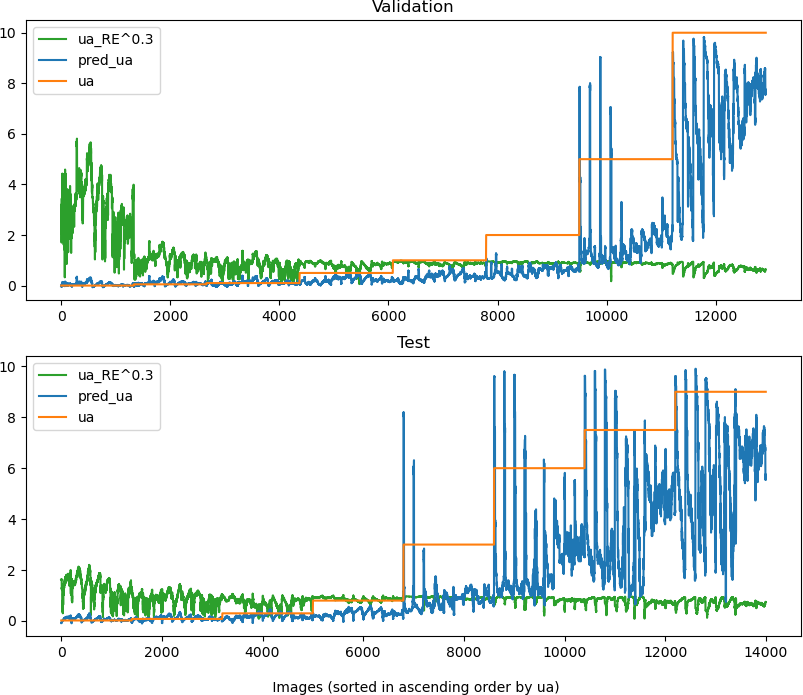

Fig. 11. Estimation error of $u_a$ of Model-2

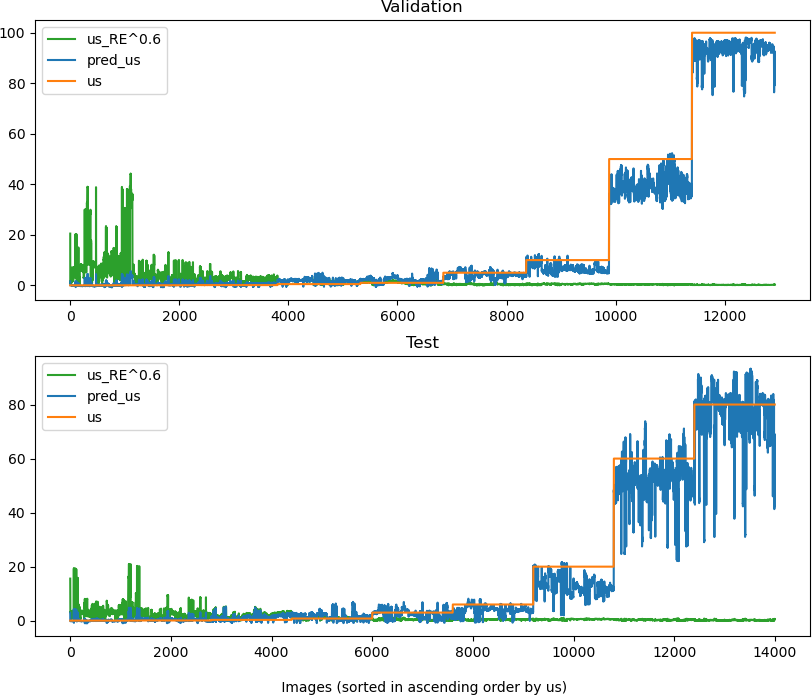

Fig. 12. Estimation error of $u_s$ of Model-2

The estimation errors of $u_a$ and $u_s$ show a similar trend: large for small values and small for large. But, **the relative errors are too large to accept!** It can also be seen that the test error is smaller than the validation error, which may indicate that the distribution of the test and validation data sets are different. 

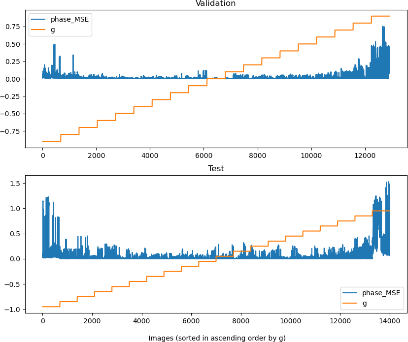

Fig. 13. Estimation error of phase function of Model-2

When the absolute value of $g$ is large, a large estimation error of the phase function occurs. Is there a relationship between the phase error and the number of non-zero pixels in an image? I sort the images in scending order of the non-zero pixel number. 

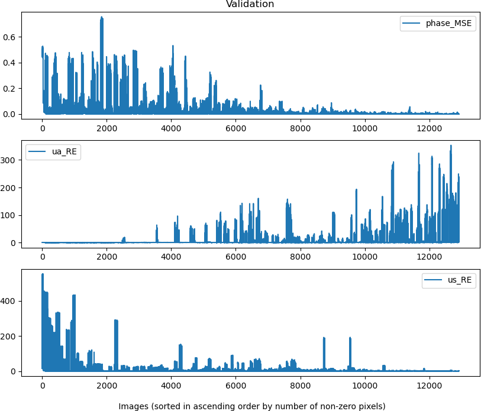

Fig. 14. Validation errors of Model-2

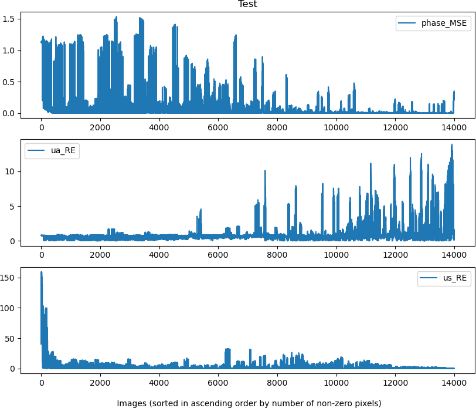

Fig. 15. Test errors of Model-2

The phase error tends to decrease as the number of non-zero pixels increases, indicating that more information in the image contributes to learning. However, the valleys (small errors) in the phase error plot suggest that the number of non-zero pixels may not be the only factor in accurate learning. The estimation error of $u_s$ has a similar trend to that of the phase function, but the estimation error of $u_a$ increases with the number of non-zero pixels. 

The above results demonstrate that estimation of the phase function together simultaneously with the optical parameters $u_a$ and $u_s$ is a difficult problem. The complexity comes from the fact that the three factors are integrated when generating the images and training the neural network, as the loss of phase is added to the loss of $u_a$ and $u_s$. Another possibility is that the parameter range varies widely and  in an enumerated manner, which may generate unrealistic materials.